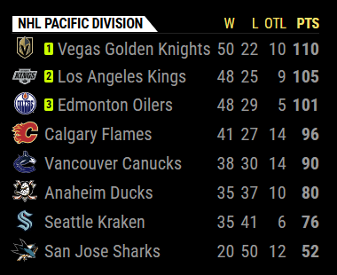

# MMM-MyStandings
MagicMirror module to get ESPN standings for the major US sports.  This is a fork of the original MMM-MyStandings from user vincep5.  It has been updated with the ability to display multiple modules simultaneously and to patch some vulnerabilities.

vincep5 was inspired by MMM-MyScoreboard and figured that this will complement it nicely.
The module will rotate through different sports.  If you only want to show one sport or one division, the module will just display one without rotating.

## Preview


## Installing the module
```bash
cd ~/MagicMirror/modules
git clone https://github.com/dathbe/MMM-MyStandings
cd MMM-MyStandings
npm install
```

## Updating the module
```bash
cd ~/MagicMirror/modules/MMM-MyStandings
git pull
npm install
```

## Config
Add `MMM-MyStandings` module to the `modules` array in the `config/config.js` file.
````javascript
modules: [
{
	module: "MMM-MyStandings",
	position: "top_right",
	config: {
		sports: [
			{ league: "NBA", groups: ["Atlantic", "Central", "Southeast", "Northwest", "Pacific",
							"Southwest", "Western Conference", "Eastern Conference",
							"National Basketball Association"] },
			{ league: "MLB", groups: ["American League East", "American League Central",
							"American League West", "National League East",
							"National League Central", "National League West",
							"American League", "National League",
							"Major League Baseball", "AL Playoffs", "NL Playoffs",
							"AL Wild Card", "NL Wild Card"] },
			{ league: "NFL", groups: ["AFC East", "AFC North", "AFC South", "AFC West", "NFC East",
							"NFC North", "NFC South", "NFC West",
							"American Football Conference", "National Football Conference",
							"National Football League", "AFC Playoffs", "NFC Playoffs"] },
			{ league: "NHL", groups: ["Atlantic Division", "Metropolitan Division", "Central Division",
							"Pacific Division", "Western Conference", "Eastern Conference",
							"National Hockey League", "West Playoffs", "East Playoffs",
							"West Wild Card", "East Wild Card"] },
			{ league: "MLS", groups: ["Eastern Conference", "Western Conference"] },
			{ league: "NCAAF", groups: ["American Athletic Conference", "Atlantic Coast Conference",
							"Big 12 Conference", "Big Ten Conference", "Conference USA",
							"FBS Independents", "Mid-American Conference",
							"Mountain West Conference", "Pac-12 Conference",
							"Southeastern Conference", "Sun Belt - East",
							"Sun Belt - West"] },
			{ league: "NCAAM", groups: ["America East Conference", "American Athletic Conference",
							"Atlantic 10 Conference", "Atlantic Coast Conference",
							"ASUN Conference", "Big 12 Conference", "Big East Conference",
							"Big Sky Conference", "Big South Conference",
							"Big Ten Conference", "Big West Conference",
							"Colonial Athletic Association", "Conference USA",
							"Horizon League", "Ivy League",
							"Metro Atlantic Athletic Conference", "Mid-American Conference",
							"Mid-Eastern Athletic Conference",
							"Missouri Valley Conference", "Mountain West Conference",
							"Northeast Conference", "Ohio Valley Conference", "Patriot League",
							"Southeastern Conference", "Southern Conference",
							"Southland Conference", "Southwestern Athletic Conference",
							"Summit League", "Sun Belt Conference", "West Coast Conference",
							"Western Athletic Conference"] },
			{ league: "NCAAW", groups: ["ASUN Conference", "America East Conference",
							"American Athletic Conference", "Atlantic 10 Conference",
							"Atlantic Coast Conference", "Big 12 Conference",
							"Big East Conference", "Big Sky Conference", "Big South Conference",
							"Big Ten Conference", "Big West Conference",
							"Colonial Athletic Association", "Conference USA", "Horizon League",
							"Ivy League", "Metro Atlantic Athletic Conference",
							"Mid-American Conference", "Mid-Eastern Athletic Conference",
							"Missouri Valley Conference", "Mountain West Conference",
							"Northeast Conference", "Ohio Valley Conference", "Patriot League",
							"Southeastern Conference", "Southern Conference",
							"Southland Conference", "Southwestern Athletic Conference",
							"Summit League", "Sun Belt Conference", "West Coast Conference",
							"Western Athletic Conference"] },
			{ league: "NCAAF Rankings", groups: ["AP Top 25", "AFCA Coaches Poll", "FCS Coaches Poll",
							"AFCA Division II Coaches Poll", "AFCA Division III Coaches Poll"] },
			{ league: "NCAAM Rankings", groups: ["AP Top 25", "Coaches Poll"] },
			{ league: "NCAAW Rankings", groups: ["AP Top 25", "Coaches Poll"] }
		],
	}
}
]
````

Select the groups you want to rotate through or no groups to rotate through all groups in the league:

`{ league: "English Premier League" }` will display English Premier League overall standings (because there are no divisions/groups)
<br>`{ league: "MLB" }` will rotate through all MLB divisions
<br>`{ league: "NFL", groups: ["AFC East", "AFC North"] }` will rotate between AFC East and AFC North
<br>`{ league: "NBA", groups: ["Atlantic"] }` will display only the Atlantic Division

| Option | Description
| ------- |  -------
| updateInterval | Time in milliseconds to update data from ESPN<br><br>**Type:** `int` <br> **Default value:** `4 * 60 * 60 * 1000` (every 4 hours)
| rotateInterval | Time in milliseconds to rotate through the leagues or divisions<br><br>**Type:** `int` <br> **Default value:** `1 * 60 * 1000` (every 1 minute)
| nameStyle | Display abbreviation, full name, or short name for the team<br><br>**Type:** `string` Options: `abbreviation`, `full`, or `short`<br> **Default value:** `short`
| showLogos | Display logos (true) or not (false)<br><br>**Type:** `boolean` <br> **Default value:** `true`
| useLocalLogos | Display logos from folder if they are available (`true`) or displays all logos from the ESPN url (`false`)<br><br>**Type:** `boolean` <br> **Default value:** `true`
| colored | Chooses whether to display the module in full color (`true`) or grayscale (`false`)<br><br>**Type:** `boolean` <br> **Default value:** `true`
| showByDivision | Rotate through each division/group separately (`true`) or show all divisions/groups at once stacked on top of one another (`false`).  Note that `false` only combines divisions of the same type.  For example, in MLB, divisions will be grouped together, NL/AL leagues will be grouped together, playoffs will be grouped together, and wild cards will be grouped together.<br><br>**Type:** `boolean` <br> **Default value:** `true`
| fadeSpeed | Time in milliseconds to display the module<br><br>**Type:** `int` <br> **Default value:** `2000` (2 seconds)
| rankingLength | The number of teams to display when using `NCAAF Rankings` or `NCAAM Rankings`<br><br>**Type:** `int` <br> **Default value:** `25` (all rankings)
| addLeagueToTitle | Adds the league name to the displayed table title<br><br>**Type:** `boolean` <br> **Default value:** `true`


## Soccer Leagues
<details>
  <summary><b>Available Soccer Leagues</b> (click to expand)</summary>
	
	//International Soccer
	AFC Champions League Two
	AFC Asian Cup Qualifiers
	ASEAN Championship
	Africa Cup of Nations
	Africa Cup of Nations Qualifying
	African Nations Championship
	Copa América
	FIFA Club World Cup
	FIFA Confederations Cup
	Men's Olympic Soccer Tournament
	Women's Olympic Soccer Tournament
	FIFA Women's World Cup
	FIFA World Cup
	FIFA World Cup Qualifying - AFC
	FIFA World Cup Qualifying - CAF
	FIFA World Cup Qualifying - Concacaf
	FIFA World Cup Qualifying - CONMEBOL
	FIFA World Cup Qualifying - OFC
	FIFA World Cup Qualifying - UEFA
	FIFA Under-17 World Cup
	FIFA Under-20 World Cup
	UEFA Champions League
	UEFA Conference League
	UEFA Europa League
	UEFA European Championship
	UEFA European Championship Qualifying
	UEFA European Under-19 Championship
	UEFA European Under-21 Championship
	UEFA Nations League
	SAFF Championship
	UEFA Women's European Championship

	//UK/Ireland Soccer
	English League Championship
	English EFL Trophy
	English League One
	English League Two
	English National League
	English Premier League
	Irish Premier Division
	Northern Irish Premiership
	Scottish League Cup
	Scottish Championship
	Scottish League One
	Scottish League Two
	Scottish Premiership
	Welsh Premier League

	//European Soccer
	Austrian Bundesliga
	Belgian Pro League
	Danish Superliga
	Spanish LALIGA
	Spanish LALIGA 2
	French Ligue 1
	French Ligue 2
	German 2. Bundesliga
	German Bundesliga
	Greek Super League
	Israeli Premier League
	Italian Serie A
	Italian Serie B
	Maltese Premier League
	Dutch Keuken Kampioen Divisie
	Dutch Eredivisie
	Norwegian Eliteserien
	Portuguese Primeira Liga
	Romanian Liga 1
	Russian Premier League
	Swiss Super League
	Swedish Allsvenskan
	Turkish Super Lig

	//South American Soccer
	Copa Argentina
	Argentine Nacional B
	Argentine Primera B
	Argentine Primera C
	Argentine Primera D
	Argentine Liga Profesional de Fútbol
	Bolivian Liga Profesional
	Brazilian Campeonato Carioca
	Brazilian Campeonato Gaucho
	Brazilian Campeonato Mineiro
	Brazilian Campeonato Paulista
	Brazilian Serie A
	Brazilian Serie B
	Brazilian Serie C
	Chilean Primera División
	Colombian Primera A
	Colombian Primera B
	CONMEBOL Libertadores
	CONMEBOL Sudamericana
	LigaPro Ecuador
	Paraguayan Primera División
	Peruvian Liga 1
	Liga UAF Uruguaya
	Venezuelan Primera División

	//North American Soccer
 	Concacaf Gold Cup
	Concacaf Nations League
	Concacaf Nations League Qualifying
	Concacaf W Championship
	Costa Rican Primera Division
	Guatemalan Liga Nacional
	Honduran Liga Nacional
	Jamaican Premier League
	Mexican Liga de Expansión MX
	Mexican Copa MX
	Mexican Liga BBVA MX
	Salvadoran Primera Division
	NCAA Men's Soccer
	NCAA Women's Soccer
	MLS
	North American Soccer League
	NWSL
	U.S. Open Cup
	USL Championship

	//Asian Soccer
	AFC Champions League Elite
	Australian A-League Men
	Chinese Super League
	Indonesian Liga 1
	Indian I-League
	Indian Super League
	Japanese J.League
	Malaysian Super League
	Singaporean Premier League
	Thai League 1

	//African Soccer
	CAF Champions League
	CAF Confederation Cup
	Ghanaian Premier League
	Kenyan Premier League
	Nigerian Professional League
	South African First Division
	South African Premier Division
	Ugandan Premier League
	Zambian Super League
	Zimbabwean Premier Soccer League
	Premiership Rugby
	Rugby World Cup
	Six Nations
	The Rugby Championship
	European Rugby Champions Cup
	United Rugby Championship
	Super Rugby Pacific
	Olympic Men's 7s
	Olympic Women's Rugby Sevens
	International Test Match
	URBA Top 12
	Mitre 10 Cup
</details>

If your soccer competition has groups and you want to see groups rotate, consider this as your config
````javascript
{ league: "FIFA World Cup", groups: ["Group A"] }, //only show group A
{ league: "FIFA World Cup", groups: ["Group A", "Group B", "Group C", "Group D", "Group E", "Group G", "Group H"] } //rotates through selected groups
{ league: "FIFA World Cup" } //rotates through all groups or displays overall standings if there are no groups
````
## Rugby Leagues
<details>
  <summary><b>Available Rugby Leagues</b> (click to expand)</summary>
	
	//Rugby
	Premiership Rugby
	Rugby World Cup
	Six Nations Rugby
	The Rugby Championship
	European Rugby Champions Cup
	United Rugby Championship"
	Super Rugby Pacific
	Olympic Men's 7s Rugby
	Olympic Women's Rugby Sevens
	International Test Match Rugby
	URBA Top 12 Rugby
	Mitre 10 Cup Rugby
</details>

Rugby leagues work similarly to soccer leagues.

# Thank You
Special thank you to [vincep5](https://github.com/vincep5/), who created the original version of this module and did most of the work.
